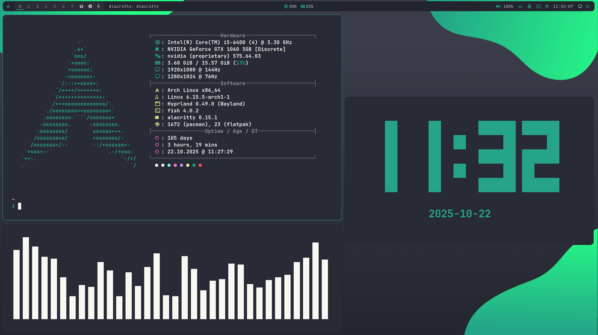
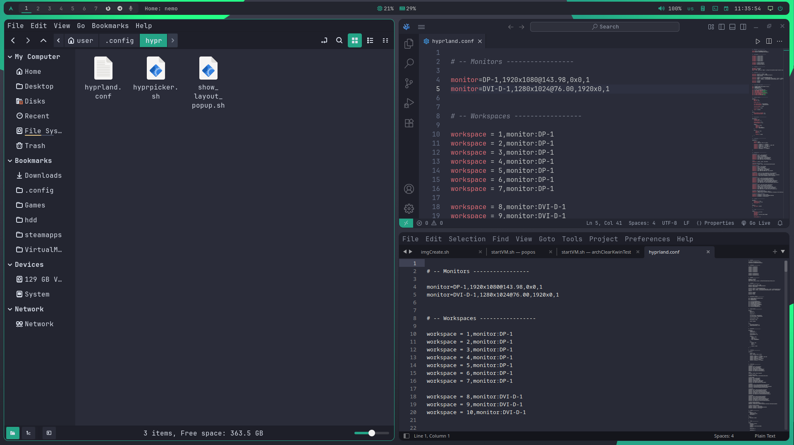

<h1 align="center">Hyprland Dracula Mint</h1>

<!-- INFORMATION -->
<h1 align="left"> :blue_book: About</h1> 

<table align="center">
   <tr>
      <th align="center">
         <sup>:warning: WARNING :warning:</sup>
      </th>
   </tr>
   <tr>
      <td align="center">
        THIS CONFIGURATION WAS NOT DESIGNED FOR USE BY OTHER PEOPLE,
        SO I RECOMMEND YOU STUDY ALL THE CONFIGURATION FILES AND MORE
        BEFORE INSTALLING
   </tr>
   </table>



</br>

 - OS: [**`Arch Linux`**](https://archlinux.org/)
 - WM: [**`Hyprland`**](https://github.com/hyprwm/Hyprland)
 - Bar: [**`Waybar`**](https://github.com/Alexays/Waybar)
 - Terminal: [**`Alacritty`**](https://github.com/alacritty/alacritty)
 - App Launcher: [**`Rofi`**](https://github.com/davatorium/rofi)
 - Notify Daemon: [**`Dunst`**](https://github.com/dunst-project/dunst)
 - Shell: [**`Fish`**](https://github.com/fish-shell/fish-shell)

</br>

<!-- IMAGES -->
## 🖼️ Gallery





<!-- INSTALLATION -->
## :blue_book: Installation
```
git clone https://github.com/Vl0di4/Hyprland-Dracula-Mint
cd Hyprland-Dracula-Mint
chmod +x setup_hyprland.sh
bash setup_hyprland.sh
```

#

The original of this markdown file was taken from [ZProger bspwm-dotfiles](https://github.com/Zproger/bspwm-dotfiles)
